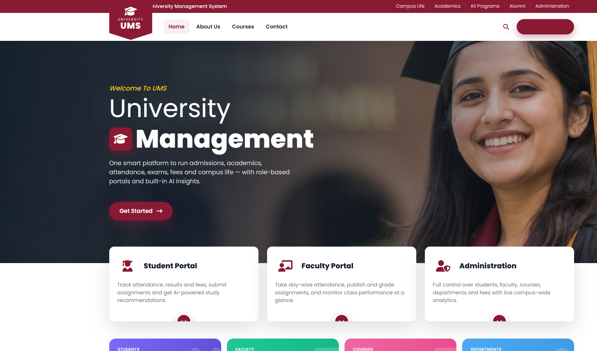

# 🎓 University Management System (UMS)

A modern, full-stack **University Management System** built with **Django**. It ships with
three role-based portals (Admin, Faculty, Student), each with its **own theme, colour scheme
and tools**, a public marketing site, rich charts, and **built-in AI features that need no API key**.

> Built as a demo for the **LazyCoder** YouTube channel. All seeded data is privacy-safe
> (emails use `@example.com`, phone numbers are `0000`) so it can be shown publicly.

---

## 📸 Screenshots




---

## ✨ Features

### Role-based portals (each with a distinct theme)
| Role | Theme | Highlights |
|------|-------|-----------|
| 🛡️ **Admin** | Indigo / Purple | Students, faculty, departments, courses & fees management, enrollment & fee-collection charts, at-risk detection |
| 🧑‍🏫 **Faculty** | Teal / Green | My courses, one-click attendance, assignment grading, class performance & grade-distribution charts |
| 🎓 **Student** | Blue / Orange | Attendance, results/GPA, assignment submission, fees, AI grade prediction & study tips |

### Public website (with navbar)
- Landing page with hero, live stats, features, departments, featured courses & CTA
- **About Us**, **Contact**, **Course Catalog** (searchable)
- **Login** & **Sign Up** (self-registration creates a Student account)

### 🤖 Built-in AI (no API key, fully offline)
- **AI Assistant** – chat widget that answers questions from your live database
  (attendance, results, fees, course & campus stats)
- **Performance Predictor** – explainable weighted model projecting a student's term score
- **At-Risk Detector** – flags students who need attention
- **Smart Recommendations** – personalised study tips per student

### Academics engine
- Departments, Programs, Courses, Academic Terms
- Enrollments, Attendance, Assignments & Submissions, Exams & Results
- Fee invoices & payments, Events, Notice board

### UX
- Custom UI (no default Django admin template) with **Bootstrap 5**, **Chart.js**,
  **Font Awesome** & **Bootstrap Icons**
- Fully **responsive** (mobile sidebar, fluid grids)
- Image & icon rich throughout

---

## 🚀 Getting started

### 1. Prerequisites
- **Python 3.11+** (tested on 3.14)

### 2. Setup

```bash
# from the project folder: UniversityManagementSystem/

# (recommended) create a virtual environment
python -m venv .venv
# Windows
.venv\Scripts\activate
# macOS / Linux
source .venv/bin/activate

# install dependencies
pip install -r requirements.txt

# apply database migrations
python manage.py migrate

# load demo data (students, faculty, courses, attendance, fees, events...)
python manage.py seed_demo

# start the server
python manage.py runserver
```

Now open **http://127.0.0.1:8000/** 🎉

> Tip: on Windows PowerShell, if port 8000 is stuck from a previous run, start on another
> port: `python manage.py runserver 8001`.

---

## 🔑 Demo logins

All demo accounts use the password **`demo1234`**.

| Role | Username | Password |
|------|----------|----------|
| 🛡️ Admin | `admin` | `demo1234` |
| 🧑‍🏫 Faculty | `prof.rao` | `demo1234` |
| 🎓 Student | `stu.aarav` | `demo1234` |

After logging in you're routed to the dashboard for that role automatically.
(`admin` is also a Django superuser, so `/django-admin/` works too.)

---

## 🌱 Re-seeding data

```bash
python manage.py seed_demo         # wipes demo data and re-creates it
python manage.py seed_demo --keep  # adds data without wiping
```

The seeder creates ~45 students, 10 faculty, 18 courses, 200+ enrollments and
thousands of attendance/exam/fee records so every chart looks populated.

---

## 🗂️ Project structure

```
UniversityManagementSystem/
├── manage.py
├── requirements.txt
├── config/                 # project settings, urls, wsgi/asgi
├── accounts/               # custom User + roles + Student/Faculty profiles + auth
├── university/             # domain models, dashboards, services, AI, seeder
│   ├── ai.py               # local AI: predictor, assistant, at-risk, recommendations
│   ├── services.py         # analytics & chart-data builders
│   ├── context_processors.py  # per-role theming
│   └── management/commands/seed_demo.py
├── templates/
│   ├── base_public.html    # public navbar + footer
│   ├── base_dashboard.html # themed sidebar + topbar shell
│   ├── public/  accounts/  dashboard/
├── static/css/ums.css, static/js/ums.js
├── docs/screenshots/       # screenshots used in this README
└── report/                 # 50+ page project report (.docx) with all diagrams
```

---

## 📄 Project report

A detailed **50+ page project report** (with architecture, ER, DFD, use-case, class,
sequence and activity diagrams) is available at:

```
report/University_Management_System_Project_Report.docx
```

---

## 🛡️ Privacy note

All seeded personal fields are intentionally anonymised:
- **Emails:** `<username>@example.com`
- **Phone numbers:** `0000`

No real personal information is present, making the project safe to demo on video.

---

## 🧰 Tech stack

- **Backend:** Django 6, SQLite
- **Frontend:** Bootstrap 5, Chart.js, Font Awesome, Bootstrap Icons, Google Fonts (Poppins)
- **AI:** pure-Python heuristics (no external services / API keys)

---

Made with ❤️ for **LazyCoder**.
